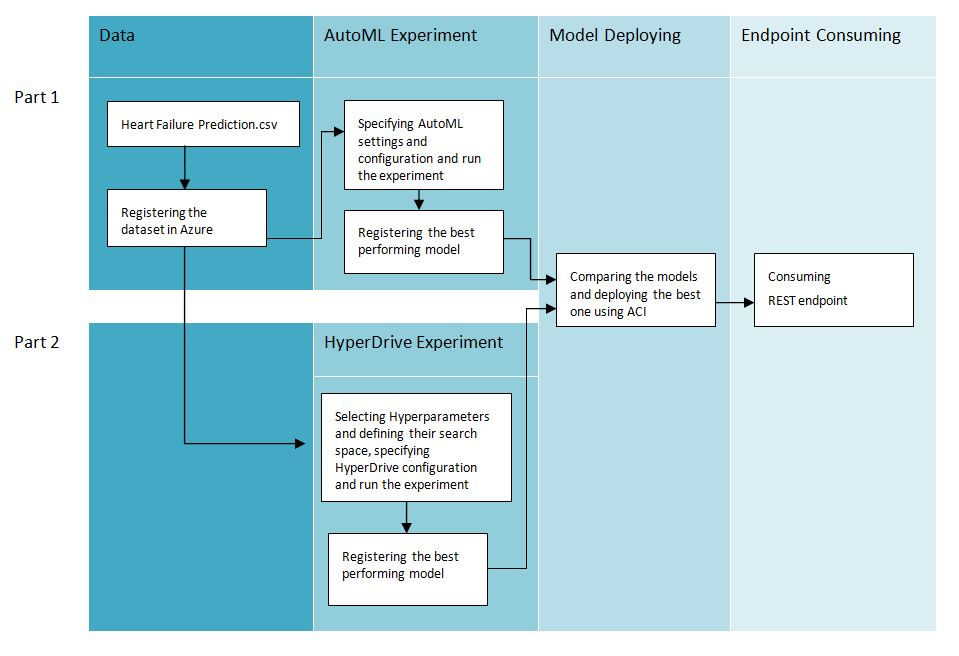
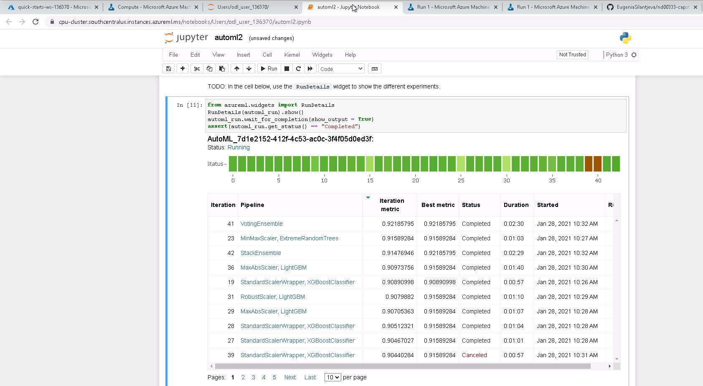
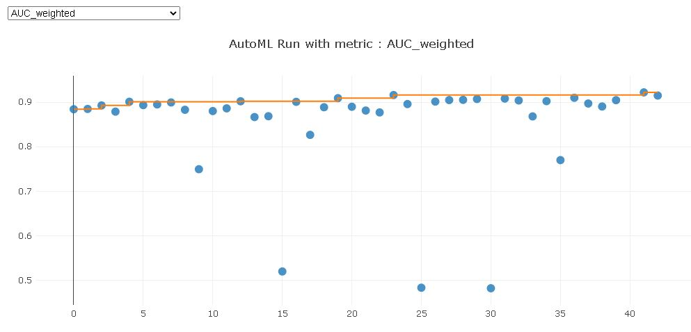
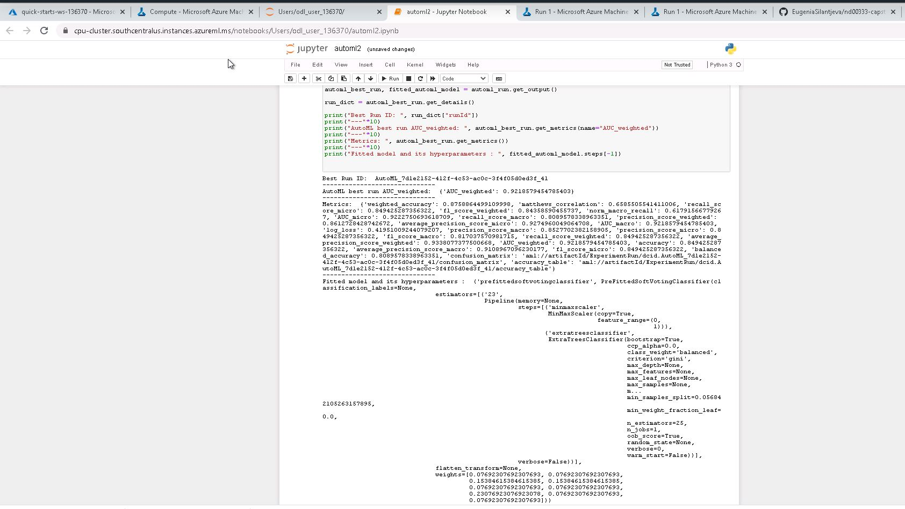
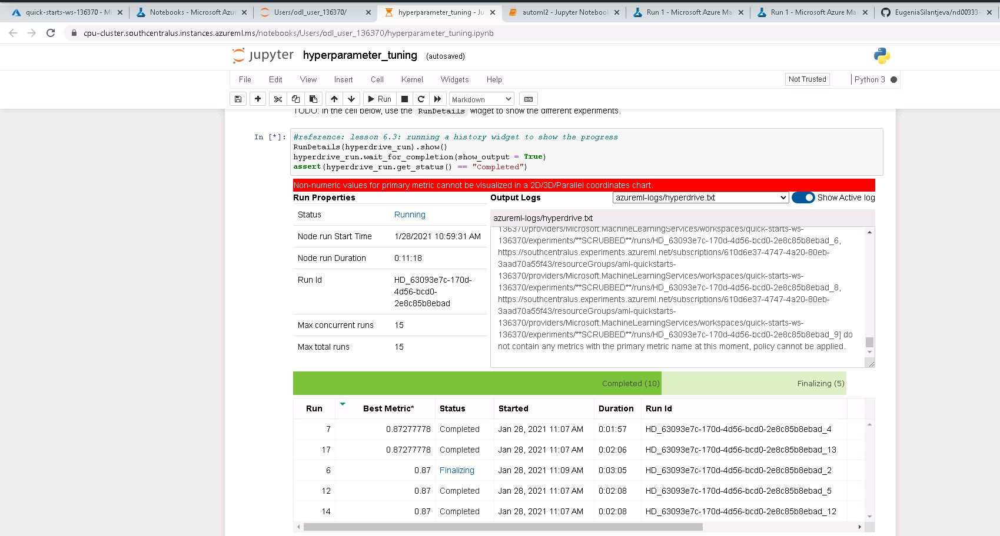
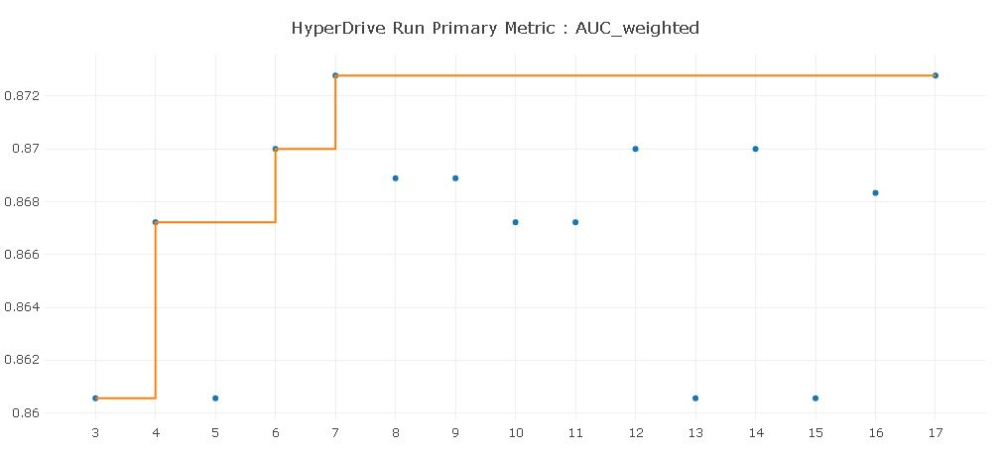
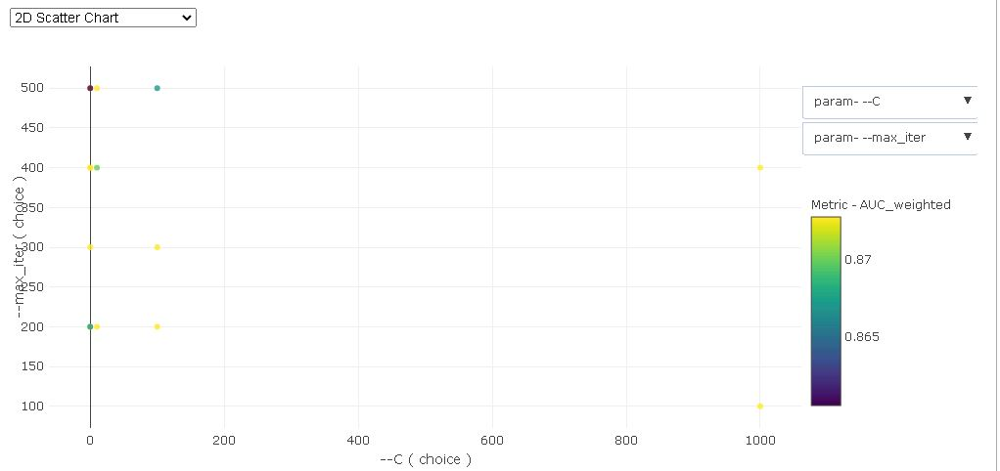

# Capstone Project - Azure Machine Learning Engineer

The aim of the project is to create two models, compare their performance, deploy the best performing model as a webservice and test the model's endpoint. The first model was trained using Automated ML and the second one  was created by  hyperparameter tuning using HyperDrive. 



## Dataset

### Overview
For this project, I used the Heart "Failure Prediction" dataset from Kaggle. The dataset contains 12 clinical features of 299 patients with heart failure and a target variable "DEATH EVENT" indicating if the patient deceased during the follow-up period (Boolean). Machine Learning can help detect and manage high-risk patients at an earlier stage.

### Task
The task was to detect the high-risk patients. To solve this binary classification problem, I will use the 12 features to predict possible death events with the help of an ML algorithm. 
12 clinical features: age, anaemia, diabetes, creatinine_phosphokinase, ejection_fraction, high_blood_pressure, platelets, serum_creatinine, serum_sodium, sex, smoking, and time. Target variable: DEATH_EVENT
Clinical Features | Description 
------------- | ----------- 
Age | Age of the patient
anaemia  | Decrease of red blood cells or hemoglobin (Boolean)
creatinine_phosphokinase | Level of the CPK enzyme in the blood (mcg/L)
diabetes | If the patient has diabetes (Boolean)
ejection_fraction | Percentage of blood leaving the heart at each contraction (percentage)
high_blood_pressure | If the patient has hypertension (Boolean)
platelets | Platelets in the blood (kiloplatelets/mL)
serum_creatinine | Level of serum creatinine in the blood (mg/dL)
serum_sodium | Level of serum sodium in the blood (mEq/L)
sex | Woman or man (binary)
smoking | If the patient smokes or not (Boolean)
time | Follow-up period (days)

Target Variable | Description 
------------- | ----------- 
DEATH_EVENT | If the patient deceased during the follow-up period (boolean)


### Access
In the first (AutoML) part of the project, I imported the dataset after I had registered it in Azure Workspace:   

```Python
found = False
key = "Heart Failure Prediction"
description_text = "Heart Failure Prediction DataSet for Udacity Project 3"
if key in ws.datasets.keys(): 
        found = True
        dataset = ws.datasets[key]
```       
        
        

In the second (Hyperdrive) part of the project, I saved the dataset to my GitHub repository and retrieved the data from a URL using TabularDatasetFactory class in train.py script: 

```Python
data_path = "https://raw.githubusercontent.com/EugeniaSilantjeva/nd00333-capstone/master/heart_failure_clinical_records_dataset.csv"
ds = TabularDatasetFactory.from_delimited_files(path=data_path)
```

## Automated ML

Parameters | Value 
------------- | ----------- 
experiment_timeout_minutes | 20
max_concurrent_iterations | 5
primary_metric | AUC_weighted
task  | Classification
compute_target | "cpu_cluster" previously created
training_data | dataset registered in Azure Workspace
label_column_name | DEATH_EVENT
enable_early_stopping | True
featurization | auto
debug_log | automl_errors.log

### Description:
**Automl Settings:** experiment_timeout_minutes - maximum amount of time the experiment can take. I set it to 20 minutes to save time. max_concurrent_iterations - maximum number of parallel runs executed on a AmlCompute cluster. Because it should be less than or equal to the number of nodes I specified when creating a compute cluster, I set it to 5. The primary metric is Under the Curve Weighted, AUC_weighted, to deal with class imbalance.<br />
**AutoMLConfig:** This is a binary classification task. "dataset" is what I have imported earlier from the registered dataset in Azure Workspace. The label inside the dataset I was trying to predict is "DEATH_EVENT". To save time and resources, the enable_early_stopping parameter was set to True.


### Results

The experiment showed that VotingEnsemble is the best performing model with the primary metric equal to 0.9218579454785403. The parameters of the model are as listed below:
### PreFittedSoftVotingClassifier

**MinMaxScaler**
Parameters | Value 
------------- | ----------- 
copy | True
feature_range | (0,1)


**ExtraTreesClassifier**
Parameters | Value 
------------- | ----------- 
bootstrap | True
ccp_alpha | 0.0 
class_weight | 'balanced'
criterion |'gini'
max_depth | None                                                                                                                                                              
max_depth | None
max_features | None
max_leaf_nodes | None
max_samples | None
min_samples_split | 0.056842105263157895
min_weight_fraction_leaf | 0.0
n_estimators | 25
n_jobs | 1
oob_score | True
random_state | None
verbose | 0
warm_start | False
                                                  
To improve the results, we can use k-fold cross validation, increase the time of the experiment and block some of the estimators that we know are not going to produce good results. We can also perform feature selection and engineering. 


The `RunDetails` widget:



The best model with its run id:


## Hyperparameter Tuning

I chose Logistic Regression because it is a widely used classifier suitable for a binary classification problem.<br />
Advantages of a Logistic Regression Classifier:
* Simple and effective algorithm suitable for two-class classification tasks
* The output of the logistic function, a probability score, is easy to interpret
* Only a few parameters to tune
* Speed of training the model is relatively high


The model was trained using different combinations of C and max_iter hyperparameters were used. C is inverse of regularization strength. Like in support vector machines, smaller values specify stronger regularization. max_iter is the maximum number of iterations taken for the solvers to converge.

Parameter | Values used for the Hyperparameter Search
------------- | ----------- 
C | 0.0001, 0.001, 0.01, 0.1, 1,10,100,1000
max_iter | 100, 200, 300, 400, 500

The primary metric to optimise was the same as in the first experiment: Under the Curve Weighted.

### Results

In the HyperDrive experiment, the best model achieved the primary metric of 0.8727777777777778 and had the following hyperparameters:

Parameters | Value 
------------- | ----------- 
C | 0.1 
max_iter | 400

To improve it, we can perform feature selection and engineering, extend the duration of the experiment, try different sampling methods and use k-fold CV method. To improve the primary metric result I would also try experimenting with all the parameters of the given estimator or with different estimators and their parameters.  


The `RunDetails` widget:




The best model with its run id:


## Model Deployment

In my experiment, the AutoML model proved to be the best performing one. I deployed the model as a web service to an Azure Container Instance (ACI), using the environment of the best run and the entry script (score.py) that was created with the model and saved in the same directory. The script initializes the service and runs the model using request data. Reference: https://docs.microsoft.com/en-us/azure/machine-learning/how-to-deploy-existing-model 

Model endpoint is active:


To query the endpoint, I created a sample input -  the clinical features of the first three patients in the dataset - and converted it to a JSON string and sent an HTTP Post request to the endpoint:
```Python
df = df.drop(columns=["DEATH_EVENT"])

input_data = json.dumps({
    'data': df[0:2].to_dict(orient='records')
})
headers = {'Content-Type': 'application/json'}
resp = requests.post(scoring_uri, input_data, headers=headers)
```
## Screen Recording
https://youtu.be/9xANJjPH5Sc

